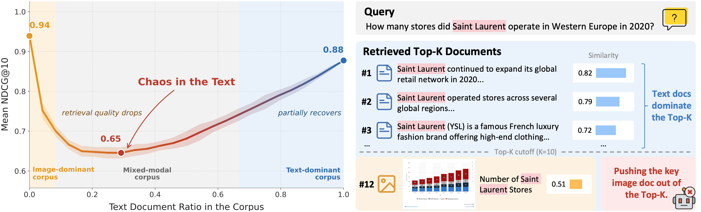
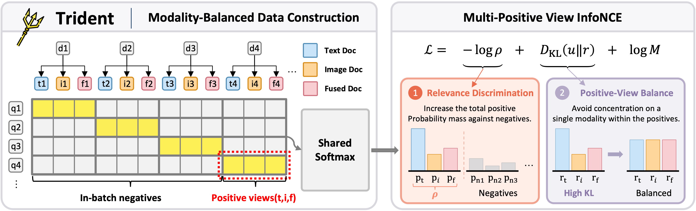

<h1 align="center">Trident</h1>

<p align="center">
  Official code for <a href="https://arxiv.org/abs/2610.11816"><i>Chaos in the Text: Revealing the Modality Preference in Mixed-Modality Retrievers</i></a>
</p>


<p align="center">
  <a href="https://arxiv.org/abs/2610.11816"></a>
  <a href="https://github.com/OpenBMB/Trident"></a>
  <a href="LICENSE"></a>
</p>

## News

- **[2026-10-10]** 🔥 We release the **training and evaluation code** of Trident, including configs, training scripts, and the Origin / Mix evaluation pipeline. Data and model checkpoints are coming soon.

## Quick Links

- [News](#news)
- [Overview](#overview)
- [Requirements / Environment Setup](#requirements--environment-setup)
- [Data Preparation](#data-preparation)
- [Experiments](#experiments)
  - [Training](#training)
  - [Evaluation](#evaluation)
  - [Table 1: Visual document retrieval](#table-1-visual-document-retrieval)
  - [Table 4: Natural-image retrieval](#table-4-natural-image-retrieval-appendix-f)
  - [Ablations and further analyses](#ablations-and-further-analyses)
  - [Important parameters](#important-parameters)
- [Repository Structure](#repository-structure)
- [Acknowledgements](#acknowledgements)
- [License](#license)
- [Contact](#contact)
- [Citation](#citation)

## Overview

<p align="center">
  
</p>

Dense retrievers perform well on text-only and image-only corpora, but real-world corpora mix text-only, image-only, and fused text-image documents. We find that retrieval performance is highly sensitive to this modality composition:

- **Chaos in the Text.** As image documents are progressively replaced by their text counterparts, NDCG@10 drops sharply and only partially recovers when the corpus becomes text-dominant. Irrelevant text hurts far more than an equal number of irrelevant images: irrelevant text documents are ranked above relevant images.
- **Modality preference.** Retrievers systematically assign higher similarity scores to text representations than to semantically equivalent image representations.

<p align="center">
  
</p>

To mitigate this bias, we propose **Trident**:

1. **Modality-balanced data construction.** Every document is represented by three co-equal positive views: a *Text* view (a detailed description), an *Image* view (the original image), and a *Fused* view (a short summary + the image).
2. **Multi-Positive View InfoNCE.** All positive views and all in-batch negatives share a single softmax denominator, and the loss averages the log-probabilities of the positives:

Trident improves mixed-modality retrieval for both CLIP-based (jina-clip-v2) and VLM-based (Qwen3-VL-2B) retrievers, flattens the V-shaped performance surface, reduces sensitivity to text distractors, and also improves average single-modality retrieval.

## Requirements / Environment Setup

The code is tested with Python 3.12, PyTorch 2.10, and **transformers 4.57.1** (Qwen3-VL requires >= 4.57, and the jina-clip-v2 remote code is not yet compatible with transformers 5.x). All experiments in the paper were run on 8 × NVIDIA A100-80GB GPUs.

```bash
git clone https://github.com/OpenBMB/Trident.git
cd Trident

conda create -n trident python=3.12 -y
conda activate trident

pip install -r requirements.txt
```

Check that the environment is complete:

```bash
python -c "import sys; sys.path.insert(0, 'src'); from mmemb.utils.env import describe_env; print(describe_env())"
```

**Baseline-specific dependencies** (only needed to reproduce the baseline rows):

| Backend | Extra setup |
|---|---|
| `unime_phi35v`, `visrag_ret` | `pip install modelscope`. VisRAG-Ret's remote code requires an older transformers (`transformers==4.40.2`); use a separate environment for it. |
| `qwen3vl_official` | Place the official `qwen3_vl_embedding.py` (class `Qwen3VLEmbedder`) from the Qwen3-VL-Embedding release in `src/`, or pass `--qwen3vl_official_script <path>`. |

## Data Preparation

Download the training data and the evaluation benchmarks:

```bash
coming soon
```

> The Hugging Face dataset repository will be announced here when the data is released.

Expected layout:

```
data/
├── Train/train.jsonl          # tri-modal training data
├── images/                    # training images (paths in train.jsonl are relative to it)
├── ChartQA/ DocVQA/ InfoVQA/ SlideVQA/ ViDoSeek/ Dude/     # Table 1
├── Google_WIT/ MSCOCO/ VisualNews/ OVEN/                   # Table 4
│   ├── queries.jsonl
│   ├── origin_corpus.jsonl    # the dataset's original single-modality corpus  -> "Origin"
│   ├── mix_corpus.jsonl       # mixed-modality version of the corpus            -> "Mix"
│   └── qrels.jsonl
```

**Training data.** We build training instances from OpenDocVQA (41k queries) following Section 4.1: Qwen3-VL-235B-A22B-Instruct generates a detailed description and a short summary for every image document. Each line contains one query and the three positive views of its document:

```json
{"query": [{"text": "How many stores did Saint Laurent operate in Western Europe in 2020?"}],
 "positive": [{"text": "<detailed description>", "id": "d1_text"},
              {"image": "chartqa/d1.png", "id": "d1_image"},
              {"text": "<short summary>", "image": "chartqa/d1.png", "id": "d1_fused"}],
 "doc_id": "d1", "query_id": "q1", "task": "default"}
```

The view order (text, image, fused) is the same in every row. Optional identity fields (`doc_id`, `query_id`, `positive_ids`, `group_id`) are used to mask false negatives in the batch; missing ids fall back to content hashes. See `src/mmemb/data/schema.py` for all supported fields.

**Evaluation data.** `queries.jsonl`, `origin_corpus.jsonl`, and `mix_corpus.jsonl` contain one record per line, `{"id": ..., "text": ..., "image": ...}` (text and/or image; image paths are relative to `data/<DATASET>/`). `qrels.jsonl` contains `{"query_id": ..., "doc_id": ..., "score": 1}`. In the *Mix* setting, each corpus is converted into a mixed-modality corpus following Section 2.1 and the corpora of all datasets of a benchmark are merged into a single pool.

## Experiments

### Training

```bash
# Trident-Qwen3VL-2B (Qwen3-VL-2B-Instruct + LoRA)
bash scripts/train.sh configs/trident_qwen3vl.yaml

# Trident-JinaCLIP (jina-clip-v2, full-parameter)
bash scripts/train.sh configs/trident_jinaclip.yaml

# override any field from the command line
bash scripts/train.sh configs/trident_qwen3vl.yaml --set train.output_dir=outputs/my_run data.train_path=data/train/train.jsonl
```

`scripts/train.sh` runs `torchrun --nproc_per_node $NUM_GPUS src/train.py --config <config>` (default `NUM_GPUS=8`). The paper uses a global batch size of 8 GPUs × 8 × 2 gradient-accumulation steps; when training on fewer GPUs, increase `train.gradient_accumulation_steps` to keep it unchanged. The final model is written to `<output_dir>/final`.

### Evaluation

`scripts/eval.sh` embeds the queries, the original corpus, and the mixed corpus of every dataset with a single model load, then reports the **Origin** (per-dataset original corpus) and **Mix** (merged mixed-modality pool) results:

```bash
bash scripts/eval.sh <model_type> <checkpoint> [vdoc|natural] [extra options]
```

Results (Recall / nDCG / MRR / MAP / Precision / Success @ {1, 5, 10}) are written to `outputs/eval/<run>/`:

- `<tag>_result.json` – Origin results per dataset,
- `mix_result.json` – Mix results per dataset plus macro / micro averages,
- `results_table.xlsx` – NDCG@10 (×100) in the layout of Table 1.

Supported `model_type`s (see `src/embedding_backends/`):

| `model_type` | Model in the paper | Checkpoint |
|---|---|---|
| `trident_qwen3vl` | **Trident-Qwen3VL-2B** (ours) | `<output_dir>/final` (released checkpoint: coming soon) |
| `trident_jinaclip` | **Trident-JinaCLIP** (ours) | `<output_dir>/final` (released checkpoint: coming soon) |
| `qwen3vl_official` | Qwen3-VL-Embedding-2B / 8B | `Qwen/Qwen3-VL-Embedding-2B`, `Qwen/Qwen3-VL-Embedding-8B` |
| `jina_clip_v2` | Jina-CLIP-v2 | `jinaai/jina-clip-v2` |
| `jina_v5_omni` | Jina-embeddings-v5-omni-small | `jinaai/jina-embeddings-v5-omni-small` |
| `unime_phi35v` | UniME-Phi3.5-V-4.2B | `DeepGlint-AI/UniME-Phi3.5-V-4.2B` |
| `visrag_ret` | VisRAG-Ret | `openbmb/VisRAG-Ret` |
| `clip_vit_l14` | CLIP-ViT-L/14 | `openai/clip-vit-large-patch14` |
| `siglip2` | SigLIP2-L/16-384 | `google/siglip2-large-patch16-384` |
| `altclip` | AltCLIP | `BAAI/AltCLIP` |

Models without native joint text–image encoding (CLIP-style dual towers, UniME, Jina-v5-omni) encode fused documents by averaging the normalized text and image embeddings with equal weights (`--clip_fusion_alpha 0.5`).

### Table 1: Visual document retrieval

Benchmarks: ChartQA, DocVQA, InfoVQA, SlideVQA, ViDoSeek, Dude (NDCG@10, Origin and Mix).

```bash
# Trident-Qwen3VL-2B (LoRA adapter checkpoint + base model)
bash scripts/eval.sh trident_qwen3vl outputs/trident_qwen3vl_2b/final vdoc \
     --base_model Qwen/Qwen3-VL-2B-Instruct

# Trident-JinaCLIP
bash scripts/eval.sh trident_jinaclip outputs/trident_jinaclip/final vdoc

# Baselines, e.g.
bash scripts/eval.sh qwen3vl_official Qwen/Qwen3-VL-Embedding-2B vdoc
bash scripts/eval.sh jina_clip_v2     jinaai/jina-clip-v2        vdoc
```

**"+ GR-CLIP" rows.** GR-CLIP is a post-hoc mean-shift calibration for CLIP-based models. Compute the modality means once per model, then evaluate with `GR_CLIP_MEANS` set:

```bash
bash scripts/compute_gr_clip_means.sh jina_clip_v2 jinaai/jina-clip-v2
GR_CLIP_MEANS=outputs/gr_clip_calib/jina_clip_v2/gr_clip_means.npz \
    bash scripts/eval.sh jina_clip_v2 jinaai/jina-clip-v2 vdoc
```

### Table 4: Natural-image retrieval (Appendix F)

Benchmarks: Google-WIT, MSCOCO, VisualNews, OVEN (the Mix corpus follows MixBench). The models are trained on 170K samples from the MMEB training sets with the same configs; point `data.train_path` to the natural-image training file:

```bash
bash scripts/train.sh configs/trident_qwen3vl.yaml \
     --set data.train_path=<natural-image train.jsonl> train.output_dir=outputs/trident_qwen3vl_2b_natural

bash scripts/eval.sh trident_qwen3vl outputs/trident_qwen3vl_2b_natural/final natural \
     --base_model Qwen/Qwen3-VL-2B-Instruct
```

### Important parameters

Training (`configs/*.yaml`, any field can be overridden with `--set key=value`):

| Parameter | Meaning |
|---|---|
| `data.num_positives: 3` | number of positive views per sample (text / image / fused). |
| `loss.modules.false_negative.mask_sibling_positives` | `false`: the positive views share one softmax denominator (**Multi-Positive View InfoNCE**, Eq. 4). `true`: each positive view is normalized independently against the negatives (no positive-view balance; ablation). |
| `loss.multi_positive_reduction` | `mean` (Eq. 4): average the log-probabilities of the positives; `joint`: only the total positive mass `-log ρ`. |
| `loss.temperature` | InfoNCE temperature τ (0.02 for Qwen3-VL, 0.05 for jina-clip-v2). |
| `loss.symmetric` | add the document-to-query direction of InfoNCE. |
| `engine.cross_device: grad` | share in-batch negatives across GPUs with gradients (`detach` / `off` are cheaper alternatives). |
| `loss.modules.false_negative.*` | mask candidates that are actually positives of the query (same `doc_id`, `positive_ids`, `group_id`, or sibling view groups). |
| `loss.modules.modality_balance.weight` | weight of the explicit Modality Balance Loss (0 = log only, used by Trident; 200 in Appendix G). |
| `loss.modules.matryoshka` | Matryoshka training over several embedding dimensions. |
| `model.lora.*`, `model.freeze_vision` | LoRA rank / alpha and whether the vision tower is frozen. |
| `model.fusion_text_weight` | (jina-clip) weight of the text embedding when fusing text + image. |
| `model.image.max_pixels` | (Qwen3-VL) maximum image resolution; the main knob for GPU memory. |

Evaluation (`scripts/run_all_datasets.sh`, called by `scripts/eval.sh`):

| Option | Meaning |
|---|---|
| `--datasets A,B` / `--benchmark vdoc\|natural` | datasets to evaluate. |
| `--no_mix` / `--only_mix` | run only the Origin or only the Mix evaluation. |
| `--gpus`, `--batch_size` | GPUs and per-GPU batch size for embedding. |
| `--base_model` | base model of a LoRA-adapter checkpoint (local path or HF repo id). |
| `--matryoshka_dims` | evaluate several truncated dimensions in one pass. |
| `--k_values` | cut-offs of the reported metrics (default `1,5,10`). |
| `GR_CLIP_MEANS` | enable GR-CLIP calibration with the given means file (CLIP-based models only). |

## Repository Structure

```
Trident/
├── configs/
│   ├── base.yaml                  # shared defaults
│   ├── trident_qwen3vl.yaml       # Trident-Qwen3VL-2B
│   ├── trident_jinaclip.yaml      # Trident-JinaCLIP
│   └── ds_zero{2,3}.json          # optional DeepSpeed configs (train.deepspeed=...)
├── data/download_data.sh          # data download script
├── figs/                          # figures used in this README
├── scripts/
│   ├── train.sh                   # training
│   ├── eval.sh                    # Origin + Mix evaluation of one model
│   ├── run_all_datasets.sh        # evaluation pipeline used by eval.sh
│   └── compute_gr_clip_means.sh   # GR-CLIP calibration means
├── src/
│   ├── train.py                   # training entry point
│   ├── mmemb/                     # training framework
│   │   ├── data/                  # multi-view datasets, collator, false-negative identities
│   │   ├── models/                # Qwen3-VL-Embedding and jina-clip-v2 encoders
│   │   ├── losses/                # (Multi-Positive View) InfoNCE, false-negative masking, modality balance
│   │   └── engine/                # HF-Trainer-based engine, cross-GPU negatives, monitoring
│   ├── embedding_backends/        # inference backends of Trident and all baselines (+ GR-CLIP)
│   ├── eval/                      # multi-GPU embedding, Origin / Mix retrieval evaluation, result tables
│   └── tools/                     # GR-CLIP mean computation
├── requirements.txt
└── LICENSE
```

## Acknowledgements

This repository builds on [transformers](https://github.com/huggingface/transformers), [PEFT](https://github.com/huggingface/peft), the official [Qwen3-VL-Embedding](https://github.com/QwenLM) model definition (Apache-2.0; adapted in `src/mmemb/models/modeling_qwen3_vl_embedding.py`), and [jina-clip-v2](https://huggingface.co/jinaai/jina-clip-v2). The GR-CLIP baseline follows [Closing the Modality Gap for Mixed Modality Search](https://arxiv.org/abs/2507.19054). We thank the authors of OpenDocVQA, ChartQA, DocVQA, InfoVQA, SlideVQA, ViDoSeek, DUDE, MixBench, and MMEB for releasing their data.

## License

This project is released under the [MIT License](LICENSE). Models and datasets used in this project are subject to their own licenses.

## Citation

If you find this work useful, please cite:

```bibtex
@article{trident2026chaos,
  title   = {Chaos in the Text: Revealing the Modality Preference in Mixed-Modality Retrievers},
  author  = {Sun, Yubo and Peng, Chunyi and Yan, Yukun and Liu, Zhenghao and Xu, Zhipeng and Mei, Sen and Xin, Linlin and Zeng, Zheni and Sun, Maosong},
  journal = {arXiv preprint arXiv:2610.11816},
  year    = {2026},
  url     = {https://arxiv.org/abs/2610.11816}
}
```
